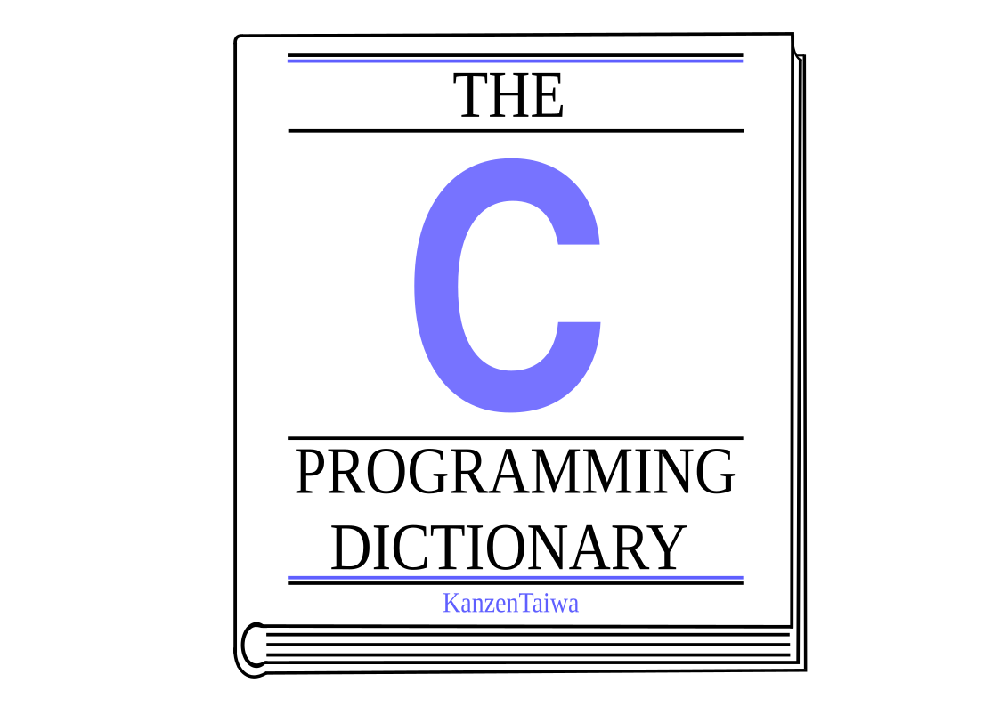

  

# The C Programming Dictionary 📘 

### Introdução 📃 
 Este projeto é um dicionário razoávelmente completo sobre a linguagem de programação C, o dicionário aborda tudo sobre a linguagem contendo
exemplos de código e definições sobre cada funcionalidade e como são aplicados os conceitos da computação aplicadas sobre C,
e quais são os conceitos que a mesma trouxe para o mundo da programação e da tecnologia mundial.
___

### Como usar o dicionário 📖
 O dicionário serve para todos que queiram aprender, reforçar e relembrar sobre conceitos, funcionalidades, paradigmas e dentre outros conteúdos inseirdos
no dicionário, o mesmo possui e segue uma ordem específica para que seja possível aprender desde o básico até o mais avançado onde começa pelo:
 
#### Conceitos
 - O arquivo [concepts](./concepts.md) demonstra conceitos, exemplos da área da tecnologia que são aplicáveis a linguagem C.

#### Expressões
 - O arquivo [express](./express.md) contém tudo o que forma uma expressão em C sendo esses os tipos, váriaveis, funções, constantes, ponteiros
e dentre outros elementos que compõe as expressões.
 
#### Controle do software
 - O arquivo [softcontrol](./softcontrol.md) descreve tudo sobre o controle de software ou seja, algoritimos, funções de laço, funções de escolha.
___

### Instalação 🖥️
 Se caso ficou interessado em baixar esse projeto utilize o seguinte comando abaixo para clonar o repositório:

```sh
git clone https://github.com/KanzenTaiwa/C-Dictionary
```
___

### Suporte 💪

 Para ajudar sinta-se livre para fazer um PR (Pull Request) do projeto, consertando erros de gráfia, imprecisão nas informações contidas 
nos dicionários, adicionando conteúdo e se tiver vontade, criar seu dicionário dentro da organização sobre a linguagem que mais tenha domínio.
 Antes de apoiar o projeto é necessário seguir uma padronização que está descrita no arquivo [standards](./standard.md). 

 O projeto está aberto a ideias e melhorias.

###### Knowledge 🧠
